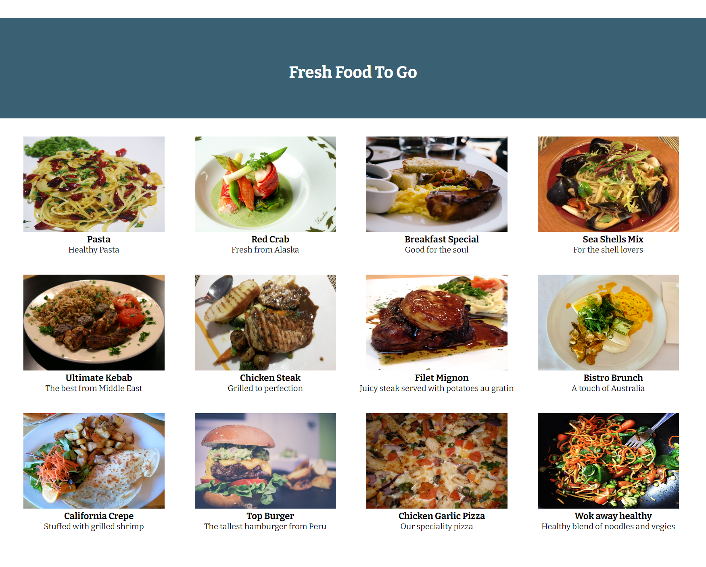

# web602-lab-week5

## Description
The lab this week is to create a plain food-catalog page using VUE.

The catalog page does not need to have any functionalities, such as making selection, adding to cart, or calculating total cost, but **simply displaying items**, for now.

The image sources, along with titles and descriptions, are provided in the text file `urls.txt`.

The goal of the lab is to practice using Vue directives, especially `v-for` and `v-bind`, as well as Vue components, custom class, so that the main HTML file should be very short and concise, like this:
```HTML
    <div id="products">
      <catalog-item v-for="item in items" v-bind:item="item"></catalog-item>
    </div>
```
The element details should happen in a separate file like `vue.js`.

Styles are nice-to-have.

## Screenshot


## Notes
Stylesheet is generated by the following command:
```
sass scss/styles.scss css/styles.css
```
